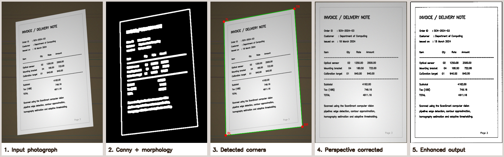
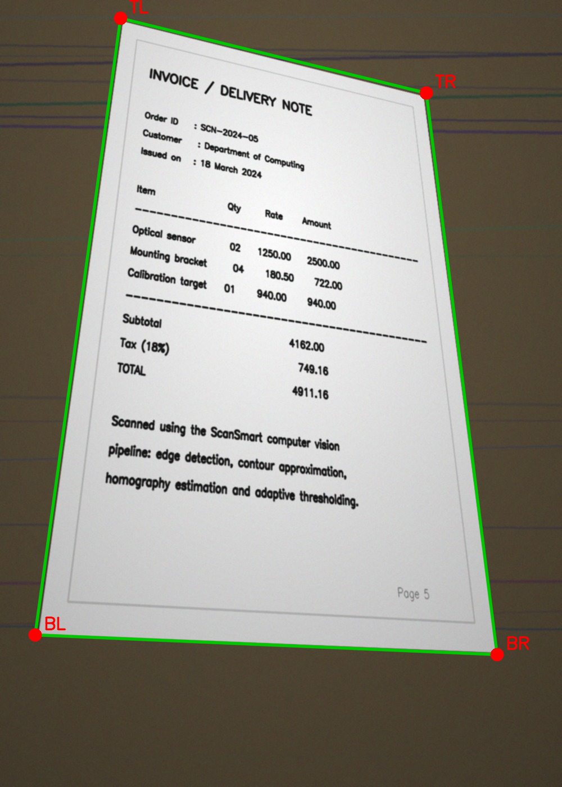
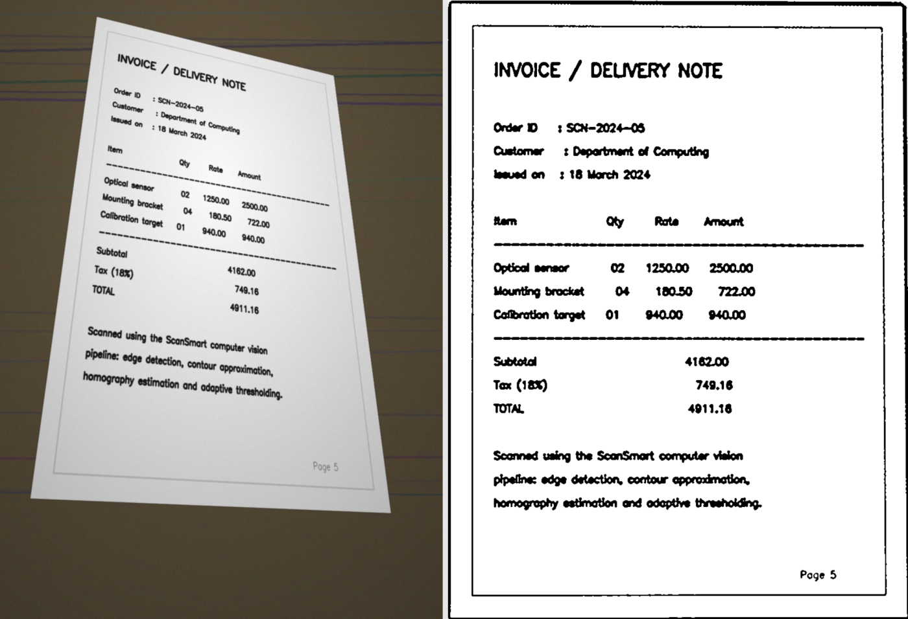

# ScanSmart — Automatic Document Scanner & Image Enhancement System

A classical **computer-vision** pipeline that turns an ordinary phone photo of a
document into a flat, clean, scanner-quality page — offline, in ~120 ms per
image, with no machine-learning model and no cloud service.



---

## 1. Overview

Photographing a page instead of scanning it introduces perspective distortion,
background clutter and uneven lighting. ScanSmart detects the four corners of
the page, estimates the homography that maps them to a rectangle, warps the
image, removes the shadow gradient and binarises the result. Every page is also
scored for sharpness, contrast and residual skew so that bad captures are
flagged automatically.

The project is deliberately built with **classical CV operators only** (Canny,
`approxPolyDP`, `getPerspectiveTransform`, adaptive thresholding, Hough lines),
so each stage can be inspected and explained.

## 2. Features

| # | Module | What it does |
|---|--------|--------------|
| **M1** | `preprocessing.py` | Grayscale conversion, CLAHE, bilateral + Gaussian filtering, median-based **auto-Canny**, morphological closing |
| **M2** | `detector.py`, `transform.py` | Contour approximation → 4-point polygon, corner ordering, **homography warp**, Hough-based deskew, 3-level fallback strategy |
| **M3** | `enhancement.py`, `quality.py` | Shadow removal, adaptive threshold / CLAHE / unsharp mask in **scan / gray / color** modes, quality metrics and GOOD–FAIR–POOR grading |
| — | `exporter.py` | Multi-page **PDF** export plus **JSON + CSV** batch reports |
| — | `pipeline.py`, `main.py` | Orchestration, batch processing, CLI, logging, exit codes |

Other features: batch folder processing, detection-overlay debug images,
before/after comparison images, structured logging, full configuration
validation, 49 tests and a ground-truth accuracy evaluation.

## 3. Technologies Used

| Tool | Purpose |
|------|---------|
| Python 3.10+ | Implementation language |
| OpenCV 4.x | All image-processing operators |
| NumPy | Array maths, corner geometry, scoring |
| reportlab + Pillow | Multi-page PDF export |
| matplotlib | Diagram and chart generation (`tools/`) |
| pytest | Unit and integration tests |
| Git | Version control |

## 4. Project Structure

```
scansmart/
├── main.py                     # CLI entry point
├── requirements.txt
├── statement.md                # problem statement, scope, users
├── scansmart/                  # library package
│   ├── config.py               # ScanConfig dataclass + validation
│   ├── exceptions.py           # error hierarchy
│   ├── logger.py               # logging setup
│   ├── io_utils.py             # safe image load / save / discovery
│   ├── preprocessing.py        # M1  edge map construction
│   ├── detector.py             # M2  page detection + fallbacks
│   ├── transform.py            # M2  homography warp + deskew
│   ├── enhancement.py          # M3  scan / gray / color output
│   ├── quality.py              # M3  metrics and grading
│   ├── exporter.py             # PDF / JSON / CSV export
│   └── pipeline.py             # orchestration
├── tests/                      # 49 pytest tests
├── tools/
│   ├── generate_samples.py     # synthetic photos + ground truth
│   ├── evaluate.py             # accuracy vs ground truth
│   ├── make_diagrams.py        # UML / architecture diagrams
│   └── make_figures.py         # result figures
├── data/samples/               # generated test photographs
└── docs/images/                # diagrams and figures
```

## 5. Installation

```bash
git clone <your-repo-url>
cd scansmart

python -m venv .venv
source .venv/bin/activate          # Windows: .venv\Scripts\activate

pip install -r requirements.txt
```

## 6. Running the Project

Generate the sample photographs (or drop your own images into a folder):

```bash
python tools/generate_samples.py -n 6 -o data/samples
```

Scan a whole folder, export a PDF and save debug images:

```bash
python main.py --input data/samples --output outputs --mode scan \
               --pdf outputs/scanned.pdf --overlay --comparison
```

Scan one photo in colour mode with debug logging:

```bash
python main.py -i photo.jpg -o outputs -m color -v
```

### CLI options

| Option | Meaning |
|--------|---------|
| `-i, --input` | image file **or** folder (required) |
| `-o, --output` | output folder (default `outputs`) |
| `-m, --mode` | `scan` (B/W), `gray`, or `color` |
| `--pdf FILE` | also bundle all pages into one PDF |
| `--overlay` | save the detected-corners image |
| `--comparison` | save a before/after image |
| `--working-height` | detection resolution in px (default 600) |
| `--min-confidence` | confidence below which a page is flagged |
| `--no-report` | skip the JSON/CSV reports |
| `-v, --verbose` | debug logging |

Exit codes: `0` all pages succeeded · `1` some pages failed ·
`2` configuration/input error · `130` interrupted.

### Example output

```
FILE                      STATUS   METHOD           CONF  GRADE      ms
-----------------------------------------------------------------------
sample_01.jpg             ok       contour          0.82   GOOD     144
sample_02.jpg             ok       min_area_rect    0.75   GOOD     149
sample_03.jpg             ok       contour          0.89   GOOD     106
sample_04.jpg             ok       contour          0.85   GOOD      89
sample_05.jpg             ok       contour          0.78   GOOD     115
sample_06.jpg             ok       contour          0.91   GOOD     103
-----------------------------------------------------------------------
Processed 6/6 (success 100%) | mean confidence 0.83 | mean time 118 ms
Grades: {'GOOD': 6, 'FAIR': 0, 'POOR': 0}
```

## 7. Testing

```bash
# unit + integration tests (49 tests)
pytest tests -v

# quantitative accuracy against synthetic ground truth
python tools/evaluate.py data/samples
```

The evaluation reports the mean corner error as a percentage of the image
diagonal; a detection counts as correct below 2 %.

```
Accuracy         : 5/6 (83.3%)
Mean corner error: 1.09% of diagonal
Mean detect time : 14 ms
```

## 8. Screenshots

Enhancement modes:



Batch results:



## 9. Known Limitations

- A page that is **clipped by the frame edge** has no closed contour, so the
  detector falls back to `minAreaRect` and the corner error grows (this is
  exactly what happens on `sample_02`).
- Folded, curved or torn pages are not modelled — the homography assumes a
  planar surface.
- Only one document per photograph is detected.

## 10. Author & License

Built as an individual VITyarthi "Build Your Own Project" submission for a
Computer Vision course. Released for academic use.
